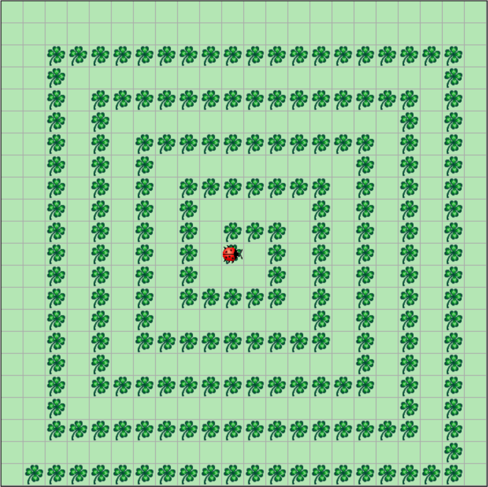
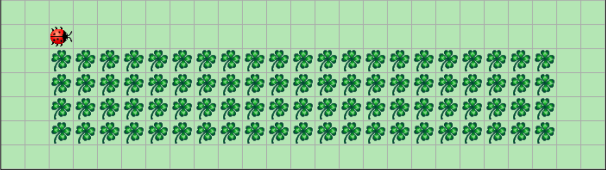
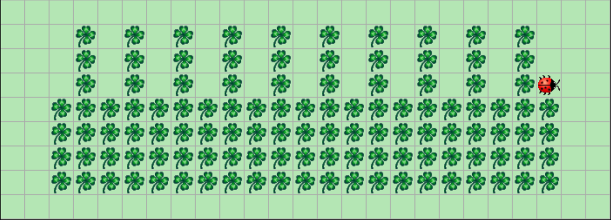
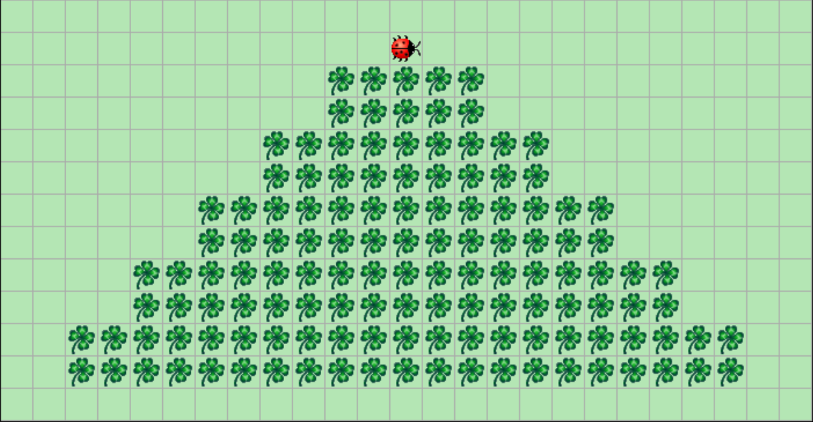

# Grundlagen

## 1. Namen sind wichtig.

Anstelle von der `MyKara` Klasse arbeiten wir nun mit der `MyKaraIO` Klasse weiter.

1. Öffne das Projekt 01 Namen sind wichtig. 
2. Gib  `MyKaraIO` folgende `act()`-Funktion:

```java
public void act() {
	String name = "";
  	name = stringInput("Wie heißt du?");
  	displayMessage("Hallo " + name);
}
```

3. Probiere dein Programm aus.
4. Ändere das Programm so, dass es fragt, wie es heißen soll und gib dann aus „Mein Name ist also “ und danach die Benutzereingabe


## 2. Einfühlsamer Rechner

Erstelle ausgehend von der letzten Aufgabe ein Programm, welches sich nach deiner Gefühlslage erkundigt. Ist diese „sehr gut“, so soll es „Oh, wie schön! :)“ ausgeben, antwortet der Nutzer mit „schlecht“ so gib aus „Oh, nein. Vielleicht hilft Schokolade?“ In allen anderen Fällen gib aus „Aha, dir geht es also… <Benutzereingabe>" 

 

## 3. Taschenrechner

1. Gib  `MyKaraIO` folgende `act()`-Funktion:

```java
public void act() {
  int sum1 = 0;
  int sum2 = 0;
  int summe = 0;

  sum1 = intInput("1. Summand");
  sum2 = intInput("2. Summand");

  summe = sum1 + sum2;

  displayMessage("Summe: " + summe);
}
```
2. Führe das Programm aus
3. Ändere das Programm so, dass 
  1. multipliziert
  2. dividiert
  3. subtrahiert

werden kann


# Einfach

## 1. Kara zerlatscht Kleeblätter

1. Öffne das Projekt 04 Kara zerlatscht Kleeblätter
2. Kara soll, so lange sie an keinen Baum stößt, auf alle Kleeblätter latschen. Anschließend soll ausgegeben werden, wie viele Kleeblätter Kara zerlatscht hat.
3. Überprüfe deine Lösung mit den anderen Welten.


# Mittel

## 1. Spiralen zeichnen



Programmiere Kara so, dass sie eine Kleeblatt-Spirale wie die obige zeichnet. Kara läuft dabei aus deren unteren Ecke los. Jede Seite wird genau 1 Kleeblatt kürzer als die Vorangehende.


# Klara erhält neue Funktionen

Über Parameter können einer Funktion Werte übergeben werden. So kann man bei folgender Methode angeben, wie viele Schritte Kara gehen soll:

```java
public void multiMove(int steps) {
    int i = 0;
    
    while (i < steps)
    {
        move();
        i = i + 1;
    }
}
```

Um z.B. 5 Schritte zu gehen, wird der Wert 5 in der Klammer angegeben:

```java
multiMove(5);
```

Um eine Methode mit mehreren Parametern aufzurufen, werden die Werte durch Kommas getrennt.

```java
drawRectangle(21, 4);
```


#### Erklärungen

Bei den bisherigen Programmen war es eher lästig, die Methoden immer mit einem Klammerpaar `()` zu versehen. Nun wird klar, dass die bisher eingesetzten Methoden nur Spezialfälle darstellten, bei denen kein Parameter übergeben wird.

In der Klammer wird der Parameter (hier `steps`) mit einem Typ angegeben (hier `int`). Mehrere Parameter werden durch Kommas getrennt. Beispiel:    

```java
public void drawRectangle(int width, int height)
```
Beim Aufruf einer Methode wird der Wert in die Variable (hier `width` und `height`) kopiert.

### 1. Kuchen backen

Wir wollen nun mit Kara für die Grossmutter einen Geburtstagskuchen "backen". Der Kuchen wird aus Kleeblättern bestehen.

Öffne die Welt 06 Baking A Cake.

Als Vorbereitung für das Backen sollen folgende Methoden zur Verfügung gestellt werden:

1. `public void turnAround()`   
  Dreht Kara um 180 Grad.

2. `public void multiMove(int steps)`   
  Kara geht die Anzahl (steps) Schritte in die aktuelle Blickrichtung (siehe Beispiel im Theorieteil).

3. `public void putLeafs(int count)`   
  Kara legt die Anzahl (count) Kleeblätter. Das erste Blatt legt er an der aktuellen Position, die weiteren fortgesetzt in seine Blickrichtung.


 

Kara soll mit Kleeblättern ein Rechteck zeichnen, welches den Kuchen symbolisiert. 

Kara startet in der Ecke unten links und schaut nach rechts. Kara soll nicht nur eine fixe Grösse eines Rechteckes zeichnen können, sondern ein Rechteck mit variabler Breite und Höhe! Der Methodenaufruf `drawRectangle(21, 4)` soll demnach ein Rechteck mit der Breite 21 und der Höhe 4 erzeugen.


### 2. Kerzen auf dem Kuchen



Öffne die Welt 07 Candles On Cake.

Damit unser Kuchen auch wie ein Geburtstagskuchen aussieht, braucht er natürlich noch ein paar Kerzen. Erweitern Sie Ihr Programm um eine zusätzliche Methode `drawCandles(int count)`, welche die angegebene Anzahl Kerzen auf den Kuchen setzt. 


## Methoden mit Rückgabewerten

Über den Rückgabewert kann eine Methode einen Wert als Ergebnis zurückliefern. So errechnet die folgende Methode eine zufällige Zahl (zwischen 0 und 9) und gibt diese als Resultat zurück:

```java
public int randomNumber() {
    int random = Greenfoot.getRandomNumber(10);
    return random;
}
```


Das Resultat kann entweder in eine Variable gespeichert oder direkt wie folgt verwendet werden:

```java
multiMove(randomNumber());
```


#### Erklärungen

Der Typ des Rückgabewerts (hier `int`) wird vor dem Namen der Methode angegeben. Wenn die Methode keinen Rückgabewert enthält, wird das mit `void` ausgedrückt.

Die Rückgabe eines Wertes innerhalb einer Methode geschieht mit `return`, gefolgt vom Wert. 

#### 1. Kerzen nach Alter

Öffne die Welt 08 Candles For Age.

Wir möchten der Grossmutter **für jedes Jahrzehnt eine Kerze** auf den Kuchen stecken. Da Rotkäppchen nicht genau weiss, wie alt die Grossmutter wird, muss es zuerst ihre Mutter fragen.

Programmiere Kara so, dass sie zuerst nach dem Alter der Grossmutter fragt und anschließend entsprechend der eingegebenen Zahl Kerzen auf dem Kuchen platziert.

**Hinweis:** Zum Erfragen des Alters kann folgende funktion mit dem Rückgabewert `int` von Kara verwendet werden:

```java
intInput("Message...")
```


#### 2. Expertenaufgabe: Torte



Öffne die Welt 09 Layered Cake.

"Backe" mit Kara eine Torte mit einer Schicht für jedes Jahrzehnt, das die Grossmutter über 50 ist. Jede Schicht soll zwei Zeilen haben und soll auf beiden Seiten um zwei Blätter nach Innen gerückt sein. 


# Expertenaufgaben: Schwierig

## Pilze suchen

1. Öffne E1 Pilze suchen.
2. Hilf Kara dabei den Pilz zu finden. Wenn sie ihn hat, soll sie anhalten.
3. Hat Kara den Pilz soll sie angeben, wie weit ervon ihrem Ausgangspunkt entfernt ist.


## Labyrinthe

Führe Kara durch das Labyrinth zum Kleeblatt. Jede horizontale Baumreihe, außer der Untersten, hat genau einen Ausgang, der in die nächst höhere Zeile führt. Diesen muss Kara jeweils finden. Hinter dem letzten Ausgang wartet das Kleeblatt auf sie.
Programmiere Kara so, dass sie das Kleeblatt findet und aufnimmt. Dabei soll sie nie an ihrem Ausgang vorbeilaufen, ohne ihn zu benutzen! Zu Beginn schaut Kara immer nach rechts.

Prüfe dein Programm in allen Welten von E2 Labyrinthe.


## Game of Life

Kara möchte dem "Game of Life" zuschauen. Ausgedacht hat sich dieses "Spiel" der amerikanische Mathematiker Conway. Die Regeln sind einfach: Ein Feld in Kara's Welt ist entweder besetzt (Kleeblatt drauf) oder unbesetzt (kein Kleeblatt drauf). Die ganze Welt kann man sich als Population von Lebewesen vorstellen, aus der sich die nächste Generation nach folgenden Regeln entwickelt:

1. Ein leeres Feld wird in der nächsten Generation besetzt, wenn es genau drei besetzte Nachbarfelder hat. Beispiel: Das mittlere, leere Feld hat drei besetzte Nachbarfelder und wird daher "geboren":

2. Ein besetztes Feld bleibt auch in der nächsten Generation besetzt, wenn es zwei oder drei besetzte Nachbarfelder hat. Beispiel: Das mittlere Feld mit Kleeblatt (hell) hat drei besetzte Nachbarfelder und bleibt daher am Leben:

3. Alle Felder, bei denen die Voraussetzungen der Regeln 1 und 2 nicht zutreffen, sind in der nächsten Generation unbesetzt. Beispiel: Das mittlere Feld mit Kleeblatt (hell) hat zu viele besetzte Nachbarfeldern und "stirbt" daher:

Auch bei relativ einfachen Startwelten (mit vier oder fünf besetzten Feldern) ist es schwierig, die Entwicklung der nächsten Generationen vorauszusehen. Man muss sie wirklich durchspielen!

Beginne mit deinem Programm in der Welt E3 Game of Life.