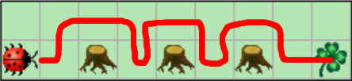
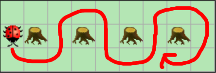

# Grundlagen

In den vorherigen Aufgaben haben wir die `act()`-Methode kennen gelernt. Nun wollen wir uns anschauen, wo das Verhalten dieser Methode denn überhaupt programmiert wurde. Dazu müssen wir den **Quelltext** im Editor öffnen: *Rechtsklick* auf die Klasse *MyKara* | *Open editor* (oder einfach *Doppelklick*).

## 1.Karas erste Schritte

1. Platziere Kara (den Marienkäfer) auf der Welt.
2. Ändere dein Programm wie folgt:
```java
public class MyKara extends Kara {	
	public void act() {
		move();
	}
}
```
3. Erweitere dein Programm, so dass Kara 3 Schritte macht
4. Lass Kara vor jeden Schritt ein Kleeblatt ablegen (Tipp: Schau in der Hilfe nach, wie der Befehl heißt)


 

## 2. Stößt sich Kara den Kopf?

1. Öffne 02 Stößt sich Kara den Kopf

2. Ergänze die `act()`-Methode:


```java
if(treeFront()) 
{
	displayMessage("Autsch, ein Baum!");
} 
else 
{
	move();
}
```

3. Prüfe in den anderen Welten, ob auch dort alles klappt.


 

## 3. Kara im Glück

1. Öffne 03 Kara im Glück.

2. Prüfe, ob Kara auf einem Kleeblatt sitzt. Gib einen Jubelschrei aus. Wenn sie auf keinen Kleeblatt sitzt, soll sie deprimiert ausstoßen, dass sie schon ihr ganzes Leben viel Pech hat.

3. Prüfe dein Programm auch in den anderen Welten.


 

## 4. Kara auf Wanderschaft

1. Öffne die erste Welt in 04 Kara auf Wanderschaft 

2. Gib folgende Befehle in dein Programm ein:

```java
   for(int i = 0; i < 5; i++) {
        move();
   }
```

3. Verwende eine andere Schleife, sodass Kara solange auf Wanderschaft ist, bis sie ein Kleeblatt erreicht. Prüfe dein Programm auch in den folgenden beiden Welten in 04 Kara auf Wanderschaft.

4. Öffne die letzte Welt in 04 Kara auf Wanderschaft. Suche eine passende Schleife, die Kara so lange laufen lässt, bis sie vor einem Baum steht.

*Expertenaufgabe: Lass Kara anschließend rufen: „Ohm, Ohm, kommt, meine Freunde! Die Ents ziehen in den Krieg!“*

 

# Einfach

## 1. Kara und die Blätter

Schreibe ein Programm, das Kara bis zum nächsten Baum führt. Liegt auf einem Feld ein Blatt, soll Kara es aufnehmen; liegt auf einem Feld kein Blatt, eines hinlegen. Bei dem Baum angekommen ist Kara fertig. 

Prüfe dein Ergebnissen in allen Welten von 05 Kara und die Blätter.


## 2. Kleeblattsuche im Wald I



Kara sucht ein Kleeblatt. Sie weiß, dass eines geradeaus vor ihr liegt - sie muss nur um die Bäume herumlaufen. Glücklicherweise stehen nie zwei Bäume nebeneinander. Schreibe ein Programm, das sie bis zum Kleeblatt führt!

Prüfe dein Programm in allen Welten von 06 Kleeblattsuche im Wald I.


## 3. Kleeblattsuche im Wald II

Erweiter dein Programm von *Kleeblattsuche im Wald I* so, dass Kara auch mit mehreren nebeneinander stehenden Bäumen zurecht kommt. 

Prüfe dein Programm in allen Welten von 07 Kleeblattsuche im Wald II.

*Hinweis: Die Lösung dieser Aufgabe erfordert eine Schleife in einer Schleife!* 


# Mittel

## 1. Kleeblatt-PacMan
Programmiere Kara so, dass er die Spur von Kleeblättern "auffrisst"! Da du weißt, dass die Spur nie entlang eines Baumes geht, kann das Programm beendet werden, sobald Kara auf einem Kleeblatt vor einem Baum steht. Du kannst selbst bestimmen, ob du auf einem Kleeblatt oder davor starten möchtest.

Prüfe dein in allen Welten von 09 Kleeblatt-PacMan.

## 2. Immer der Wand entlang
Kara möchte einen Wald im Uhrzeigersinn patrouillieren. Programmiere Kara so, dass sie endlos im Uhrzeigersinn um diesen Wald läuft.

Prüfe dein Programm in allen Welten von 10 Immer der Wand entlang.

## 3. Slaloom


Kara möchte zwischen den Bäumen Slalom fahren. Der Anfang des Slaloms ist im Bild eingezeichnet. Programmieren Sie Kara so, dass er den Slalom endlos hin- und zurück fährt. Am Anfang wird Kara immer so gedreht, dass sie zuerst eine Linkskurve machen muss.

Wie lange der Parcour ist (wieviele Bäume der Slalom hat), weiß Kara zu Beginn natürlich nicht. Es soll ihr auch egal sein, ob die Bäume horizontal oder vertikal nebeneinander stehen.

Prüfe dein Programm in allen Welten von 11 Slaloom.

*Hinweis: Du musst mehrere Bedingungen gleichzeitig prüfen.*

 

# Kara erhält neue Funktion

## Schneller mit Methode

Das vorherige Programm Slaloom sollte **mehrere gleiche Teile** enthalten, nämlich für das Herumgehen um jeden Baum. Um das oberste Prinzip der Programmierer *Never repeat yourself!* zu realisieren, werden wir eine Funktion erschaffen. Unterhalb der `act()`-Methode erstellen wir eine neue Funktion:

```java
public void quarterTurnLeft() {

}

public void quarterTurnRight() {

}
```

Schreibe zwischen die geschweiften Klammern der Funktion die Befehle, die es braucht, um um den Baum zu biegen.

Benutzen nun innerhalb der `act()`-Methode die eben neu erschaffenen Methoden 


# Expertenaufgabe

Bist du eher fertig, wäre es sehr schön, wenn du deinenMitschülern helfen würdest. Denke bitte daran, dass helfen nicht bedeutet, dass du ihr Programm schreibst oder sie deins abschreiben.

Alternativ würde ich mich freuen, wenn du dir eine eigeneAufgabe für kara ausdenkst und die zusammen mit der Lösung hier einreichst: <https://goo.gl/forms/fCPuUObToHZk6qiv1>

Du hilfst dabei den Unterricht zu verbessern.