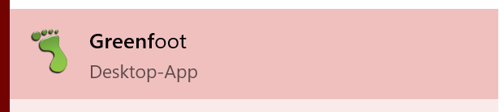
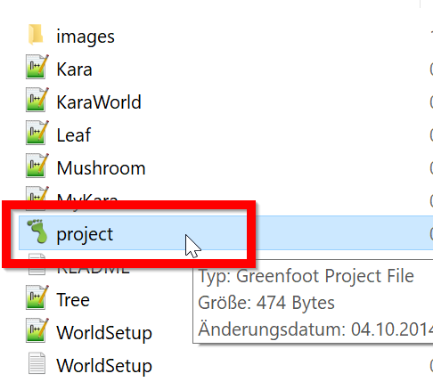
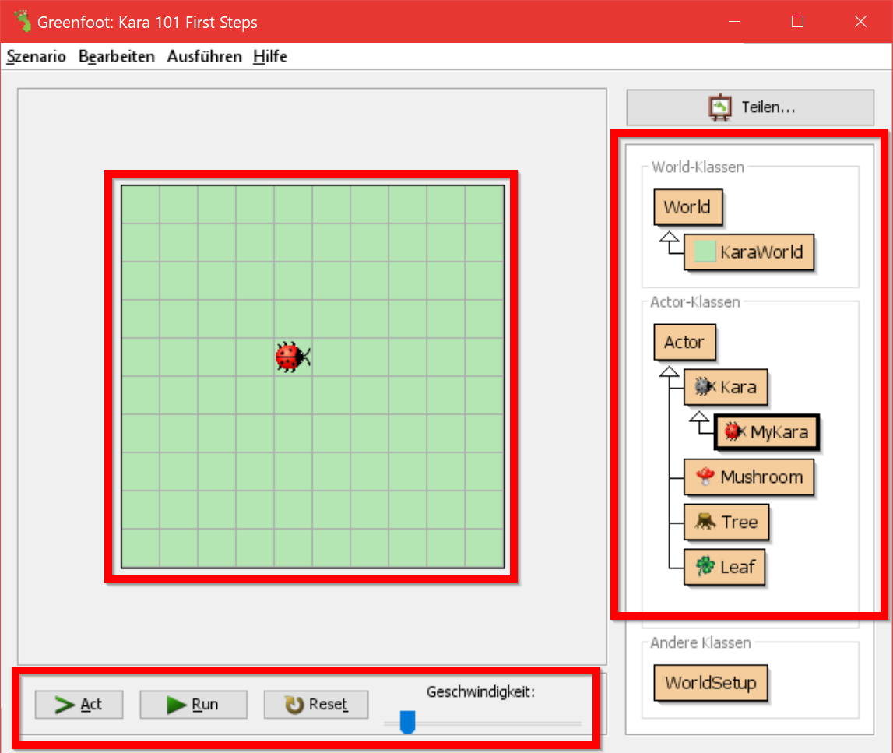
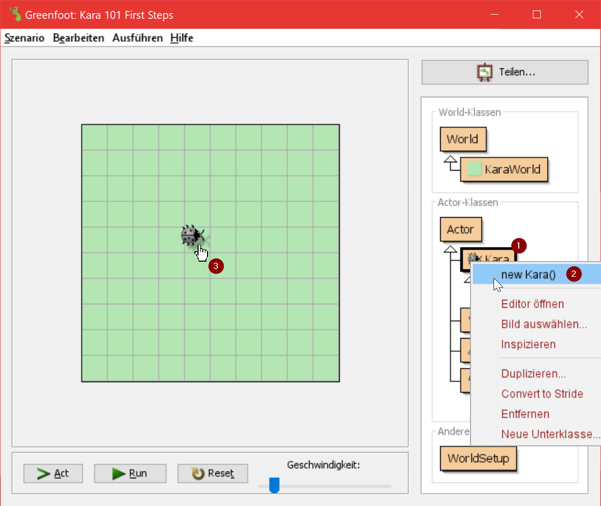
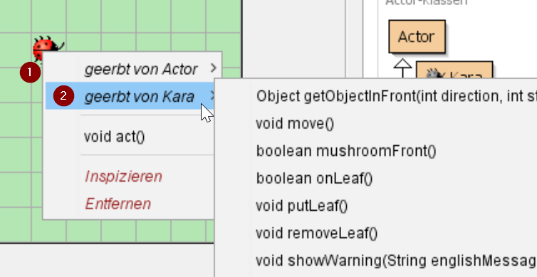
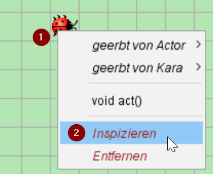

# Grundlagen
## Grennfoot installieren

[Greenfoot](https://www.greenfoot.org/) kannst du dir hier [herunterladen](https://www.greenfoot.org/download).

Zu Hause kannst du einfach dein Betriebssystem auswählen und das Programm, wie jedes andere auch, installieren.

Bist du in der Schule oder hast keine Administrationsrechte, so wählst du bei Windows *Standalone* und bei allen anderen Betriebssystemen *Pure Java*.

## Greenfoot starten

Du kannst Greenfoot über das Programmsymbol ganz normal starten:

Alternativ findest du in jedem Aufgabenverzeichnis immer eine Datei `project.greenfoot` . Mit einem Doppelklick öffnet sich Greenfoot, wie sich ein Bildbetrachter öffnet, wenn du auf `bild.jpg` klickst:

## Greenfoot Hauptfenster 

Das Greenfoot-Fenster besteht im Wesentlichen aus drei Bereichen und einigen zusätzlichen Knöpfen. Diese drei Hauptbereiche sind:

* Die **Welt**: Der größte Bereich wird Welt genannt. Dies ist der Bereich, in dem das Programm ausgeführt wird und in dem wir verfolgen können, was passiert. Im Kara-Szenario ist die Welt eine grüne Wiese mit Gitterlinien.
* Das **Klassendiagramm**: Der Bereich zur Rechten enthält die Klassen, die uns zur Verfügung stehen. In unserem Kara-Szenario brauchen wir zuerst vor allem den Käfer Kara.
* Die **Greenfoot-Steuerung**: Die Knöpfe Act, Run, und Reset und der Schieberegler für die Geschwindigkeit ganz unten dienen der Programmsteuerung:

| Steuerelement   | Funktion                                 |
| --------------- | ---------------------------------------- |
| Act             | Führt die Funktion `act` einmalig aus.   |
| Run             | Führt die Funktion `act` unendlich oft aus. |
| Reset           | Setzt die Welt wieder zurück.            |
| Geschwindigkeit | Bestimmt wie schnell die einzelnen Befehle ausgeführt werden. |

## Klassen und Objekte

Für unsere Projekte verwenden wir die Programmiersprache **Java**. Java ist eine sogenannte objektorientierte Sprache. Für objektorientierte Programmierung sind die Konzepte von Klassen und Objekten von grundlegender Bedeutung.

Betrachten wir einmal die **Klasse** `Kara`. Die Klasse `Kara` steht für das allgemeine Konzept eines Käfers – sie ist sozusagen wie ein Bauplan, aus dem wir einzelne Käfer erstellen können. Die erzeugten Käfer werden als Objekte (oder auch Instanzen) bezeichnet.

In Greenfoot erstellen wir neue Objekte wie folgt: Rechte Maustaste auf die Klasse Kara und Menüpunkt *new Kara()* auswählen. Anschliessend kann das Objekt irgendwo in der Welt (auf der grünen Wiese) mit einem Klick abgesetzt werden:

#### Mein erster Käfer

Erzeuge  ein Objekt vom (**grauen**!) Kara. Erzeuge mehrere Objekte von den Kleeblättern (Leaf).

*Tipp: Um mehrere Objekte der gleichen Klasse zu erstellen, kann die Shift-Taste gedrückt werden.*

## Mit Objekten interagieren

Zum Interagieren mit Objekten in der Welt klicken wir sie mit der rechten Maustaste an, um das **Objektmenu** aufzurufen. Das Objektmenu von Kara zeigt uns, was dieser spezielle Kara alles machen kann:

Diese Operationen werden in Java **Funktionen** genannt.

#### Lauf kara!

1. Was bewirkt die Methode move()?
2. Platzieren Sie zwei Karas in Ihrer Welt und sorge dafür, dass sich beide anschauen. Welche Funktionen benötigst du dafür?
3. Teste  weitere Funktionen. Unterteile Funktionen in zwei verschiedene Arten.

## Rückgabetypen

Das Wort vor einer Funktion wird auch als **Rückgabetyp** bezeichnet. Es teilt uns mit, was die Funktion zurückliefert, wenn wir sie aufrufen. Das Wort `void` bedeutet in diesem Falle *nichts* – sie liefern also nichts zurück und führt nur eine Aktion aus.

Wird anstelle von `void` irgendetwas anderes angegeben, wissen wir, dass die Methode uns ein Resultat zurückliefert und auch von welchem Typ dieses Resultat ist. Der Typ `boolean` kennt zwei mögliche Werte: `true` (wahr) oder `false` (falsch). Dann gibt es noch eine Reihe weiterer Typen, auf die wir später eingehen werden.

#### Was siehst du, kara?

1. Rufe die Funktion`onLeaf()` für eine Kauf. Liefert sie immer `false` zurück? Oder gibt es auch Situationen, in denen sie `true` zurückliefert?
2. Setze zusätzlich einen Baum (Tree) in die Welt. Mit welcher Methode kannst du überprüfen, ob Kara vor einem Baum steht?
3. Was passiert, wenn du Kara mittels der Methode `move()` in einen Baum laufe lässt?

## Objektzustand

Mittels *Rechtsklick | Inspect (Inspizieren)* auf einem Kara-Objekt können wir den Zustand des Objektes ermitteln:

  

#### Was geht kara?

Welche Werte, die die Position und die Richtung von Kara beschreiben, hat sie in den folgenden Situationen? 

1. ​
  

2. 
  

*Beachte: Das erste Feld oben links hat die Koordinaten (0, 0) und NICHT (1, 1)!*

## Ausführen von Programmen in Greenfoot
### Meine Kara :)

1. Platziere ein Objekt von `MyKara` auf deiner Welt. Welche Funktionen hast du nun neu zur Verfügung?
2. Was macht diese Funktionen?
3. Was passiert, wenn du in der Greenfoot-Steuerung (unten links) auf den **Act-Button** drückst?
4. Klicke auf den **Run-Button**. Was geschieht? (Versuche die Geschwindigkeit zu verstellen)
5. Welche Methoden findest du unter *Rechtsklick | inherited from Kara*? Kannst du diese auch benutzen?

